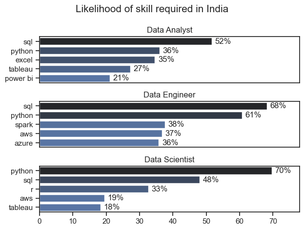

# Overview

I am pleased to present my Capstone project which focuses on the data job market, specifically data scientist roles. This project was created as a learning experience to enhance my Python skills. It delves into the top-paying and in-demand skills to help data scientists find optimal job opportunities.

The data for this project was sourced from Luke Barousse's Python Course (

https://m.youtube.com/shorts/ohB5kjKGLGc), which provided a foundation for my analysis. The course data contains detailed information on job titles, salaries, locations, and essential skills. I followed the steps outlined by the author, Luke Barousse, to complete this Capstone project. My analysis explores key questions such as the most in-demand skills, salary trends, and the intersection of skill demand and salary within the field of data analytics.

# The Questions

Below are the questions I want to answer in this project:

1. What are the skills most in demand for the top 3 most popular data roles?
2. How are in-demand skills trending for Data Analysts?
3. How well do jobs and skills pay for Data Analysts?
4. What are the optimal skills for data analysts to learn? (High Demand AND High Paying)

# Tools I Used

For my deep dive into the data analyst job market, I harnessed the power of several key tools:

- **Python:** The backbone of my analysis, allowing me to analyze the data and find critical insights.I also used the following Python libraries:
    - **Pandas Library:** This was used to analyze the data. 
    - **Matplotlib Library:** I visualized the data.
    - **Seaborn Library:** Helped me create more advanced visuals. 
- **Jupyter Notebooks:** The tool I used to run my Python scripts which let me easily include my notes and analysis.
- **Visual Studio Code:** My go-to for executing my Python scripts.
- **Git & GitHub:** Essential for version control and sharing my Python code and analysis, ensuring collaboration and project tracking.

# Data Preparation and Cleanup

This section outlines the steps taken to prepare the data for analysis, ensuring accuracy and usability.

## Import & Clean Up Data

I start by importing necessary libraries and loading the dataset, followed by initial data cleaning tasks to ensure data quality.

```python
# Importing Libraries
import ast
import pandas as pd
import seaborn as sns
from datasets import load_dataset
import matplotlib.pyplot as plt  

# Loading Data
dataset = load_dataset('lukebarousse/data_jobs')
df = dataset['train'].to_pandas()

# Data Cleanup
df['job_posted_date'] = pd.to_datetime(df['job_posted_date'])
df['job_skills'] = df['job_skills'].apply(lambda x: ast.literal_eval(x) if pd.notna(x) else x)
```

## Filter India Jobs

To focus my analysis on the India. job market, I apply filters to the dataset, narrowing down to roles based in the India.

```python
df_US = df[df['job_country'] == 'India']

```

# The Analysis 

## what are the most in demand skills for the top three most popular roles?

To find the most demanded skills for the top 3 most popular data roles. I filtered out those positions by which ones were the most popular, and got the top 5 skills for these top 3 roles. This query highlights the most popular job titles and their top skills, showing which skills I should pay attention to depending on the role I'm targeting

View my notebook with detailed steps here:
[skill_count.ipynb](3.Project/2.Skill_count.ipynb)

### Visualize Data 


    fig, ax =plt.subplots(len(job_titles), 1)

    for i, job_title in enumerate(job_titles):

        df_plot = df_skill_count[df_skill_count['job_title_short'] == job_title].head(5) 
        df_plot.plot(kind='barh',y='skill_count',x='job_skills',ax=ax[i],title =job_title)
        ax[i].invert_yaxis
        ax[i].set_ylabel('')
        ax[i].legend().set_visible(False)

    fig.suptitle('Count of Top_Skill in Job_posting', fontsize=15)

    plt.show()


### Results



### Insights

- Python and SQL are essential across all three roles, with Python being especially crucial for Data Scientists.

- SQL is critical for both Data Analysts and Data Engineers, reflecting its foundational role in data-related tasks.

- Data Engineers have a diverse set of required skills, including cloud platforms like AWS and Azure

- Visualization tools like Tableau and Power BI are more relevant for Data Analysts, while Data Scientists and Data Engineers focus more on programming languages and cloud services.


## 2. How are in-demand skills trending for Data Analyst?


    from matplotlib.ticker import PercentFormatter

    df_plot = df_da_per.iloc[:, :5]
    sns.lineplot(data=df_plot, dashes=False, palette='tab10')

    ax.yaxis.set_major_formatter(PercentFormatter(decimals=0))

    for i in range(5):
        plt.text(11.2,df_plot.iloc[-1, i], df_plot.columns[i])

    plt.show()


### Insights

- Python's Dominance: Python remains the most sought-after skill for Data Scientists in India.

- SQL's Steady Demand: SQL, a fundamental tool for data manipulation and querying, maintains a stable demand.

- AWS and Tableau: Growing Importance: Cloud computing and data visualization tools like AWS and Tableau are gaining traction.

## 3. How well do jobs and skills pay for Data Analyst?

### Salary Analysis For jobs in India

#### Visulazile Data

    sns.boxplot(data=df_us_top6,x='salary_year_avg', y='job_title_short',order=job_titles)
    sns.set_theme(style='ticks')

    plt.xlim(0,300000)
    ticks_x = plt.FuncFormatter(lambda y, pos: f'{int(y/1000)}k')
    plt.gca().xaxis.set_major_formatter(ticks_x)
    plt.show()

#### Results


- Data Engineers have the highest salary range: Among the job titles, Data Engineers show a large spread in salary, ranging from about 70k to nearly 200k, with a few outliers above 250k.

- Software Engineers show a broad salary range: Software Engineers exhibit a wider range compared to other roles, with salaries spanning from around 20k to 200k. However, the median salary is lower than that of Data Engineers or Machine Learning Engineers.

- Data Analysts have a narrower salary range: Data Analysts have the lowest salary range in the comparison, with most salaries clustering between 50k and 100k, indicating a more uniform salary distribution in this role.

### Higgest paid and most in demand skill in India

#### Visualize Data

    fig , ax =plt.subplots(2,1)
    sns.set_theme(style='ticks')


    sns.barplot(data=df_da_top_pay, x='median', y=df_da_top_pay.index, ax=ax[0],hue='median', palette='dark:b_r')

    #df_da_skills.plot(kind='barh', y='median', ax=ax[1])
    sns.barplot(data=df_da_skills, x='median', y=df_da_skills.index, ax=ax[1],hue='median', palette='light:b')
    
#### Results


#### Insights

 - Top Paying Skills: Technologies like Shell, Express, Looker, and Databricks lead as the highest-paying skills for Data Scientists, with median salaries exceeding $140k USD. These skills tend to be associated with more specialized or senior-level roles.

- Most In-Demand Skills: Azure, Pytorch, and Python are the most in-demand skills, with Azure leading in demand, likely reflecting the growth in cloud computing and AI/ML frameworks in data science.

- Salary and Demand Disparity: While Azure, Pytorch, and Python are highly in demand, their median salaries are generally lower compared to more niche skills like Shell or Looker, indicating that demand doesn't always correlate with the highest pay.

## 4. What is the most optimal skill to learn for Data Scientist

#### Visualize Data 

    sns.scatterplot(
     data=df_plot,
     y='median_salary',
     x='skill_percent',
     hue='technology'
    )

    texts = []

    for i, txt in enumerate             (df_da_skills_high_demand.index):
    texts.append(plt.text(
        df_da_skills_high_demand['skill_percent'].iloc[i],  # X-coordinate
        df_da_skills_high_demand['median_salary'].iloc[i],  # Y-coordinate
        txt  # The text to annotate (from index)
    ))

    adjust_text(texts, arrowprops=dict(arrowstyle='->', color='gray'))


### Insights

- Python Dominates Data Science Jobs: Python stands out with the highest percentage of Data Science job requirements (around 70%) and offers one of the highest median yearly salaries (approximately $160k). This suggests that Python is the most in-demand skill for Data Scientists in India.

- SQL Offers Competitive Salaries: SQL, another highly demanded skill (around 50% of jobs), also offers a relatively high median salary (approximately $150k). This reflects its critical importance in data management and analytics.

- Specialized Tools Have Lower Demand but Decent Pay: Tools like PyTorch, Keras, and TensorFlow, while not as demanded (falling between 10-20% job listings), still offer competitive salaries, ranging from $120k to $140k. This shows that specialized machine learning and deep learning libraries are valued, even if they are not required in as many job postings.

# What I Learned

Throughout this project, I learned the basics of Python and practiced using it for data cleaning, changing data, and making pictures. This was a great way to start learning Python. I used important tools like NumPy, Pandas, Matplotlib, and Seaborn. This project helped me understand how to use Python for data analysis.

- **Advanced Python Usage**: Utilizing libraries such as Pandas for data manipulation, Seaborn and Matplotlib for data visualization, and other libraries helped me perform complex data analysis tasks more efficiently.
- **Data Cleaning Importance**: I learned that thorough data cleaning and preparation are crucial before any analysis can be conducted, ensuring the accuracy of insights derived from the data.
- **Strategic Skill Analysis**: The project emphasized the importance of aligning one's skills with market demand. Understanding the relationship between skill demand, salary, and job availability allows for more strategic career planning in the tech industry.


# Insights

This project provided several general insights into the data job market for analysts:

- **Skill Demand and Salary Correlation**: There is a clear correlation between the demand for specific skills and the salaries these skills command.Advanced and specialized skills like PyTorch, TensorFlow and Keras often lead to higher salaries.
- **Market Trends**: There are changing trends in skill demand, highlighting the dynamic nature of the data job market. Keeping up with these trends is essential for career growth in data analytics.
- **Economic Value of Skills**: Understanding which skills are both in-demand and well-compensated can guide data analysts in prioritizing learning to maximize their economic returns.


# Challenges I Faced

- **Time Commitment**: Despite the video's length, completing it took approximately a month due to the focus on practicing concepts and gaining a thorough understanding.
- **Problem-Solving Approaches**: The experience highlighted the importance of leveraging resources like ChatGPT and Gemini (LLMs) to find solutions when encountering coding challenges. Additionally, consulting the documentation of relevant libraries proved invaluable for troubleshooting and learning new coding techniques.
- **Practical Experience**: Completing the video provided hands-on practice and experience in Python coding, which is essential for building proficiency and confidence in handling future coding challenges.


# Conclusion

This exploration into the data scientist job market has been incredibly informative, highlighting the critical skills and trends that shape this evolving field. The insights I got enhance my understanding and provide actionable guidance for anyone looking to advance their career in data analytics. As the market continues to change, ongoing analysis will be essential to stay ahead in data analytics. This project is a good foundation for future explorations and underscores the importance of continuous learning and adaptation in the data field